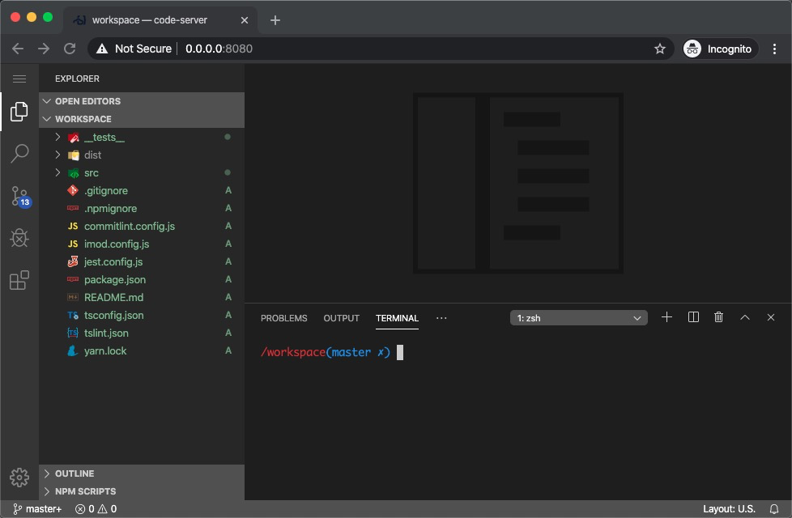

# vscode-docker

----

## 快速体验

```bash
docker run -it --rm -p 8080:8080 -v $PWD:/workspace haozhi/vscode
```



### 开发

```bash
sh dev.sh
```

### 构建

```bash
sh build.sh
```

### 验证

```bash
sh test.sh
```

## 发布

```bash
sh deploy.sh
```
